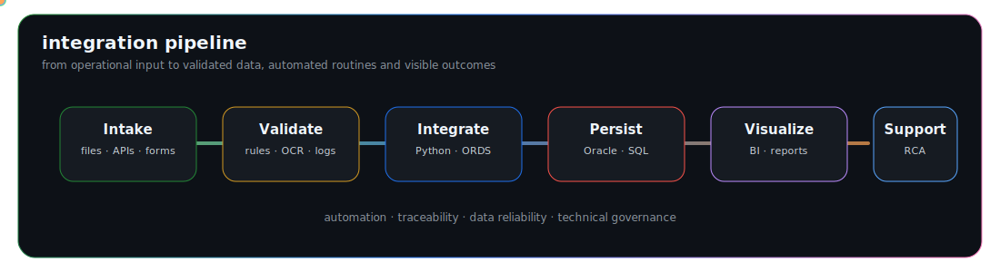

  

<h1 align="center">Natã Rafael Barbosa</h1>

  <strong>Integration Analyst · Automation · Oracle · APIs · Data Engineering · Healthcare IT</strong> 
  Building reliable bridges between systems, data and operational workflows.

  Blumenau, Santa Catarina, Brazil · Portuguese / English

  <a href="https://github.com/AKA-Nata">GitHub</a> ·
  <a href="https://github.com/Unimed-Blumenau-Desenvolvimento-TI">Corporate GitHub Organization</a>

  
  
  
  
  
  
  
  

  

---

## Operating Profile

I work at the intersection of **systems integration, automation, databases, APIs and operational analytics**.

My focus is practical engineering: understand the business process, design the integration path, automate the repetitive work, validate the data, deploy safely and keep the solution observable in production.

Most of my work happens in healthcare IT and operational environments where reliability, traceability, security and maintainability matter more than visual complexity.

  

---

## What I Usually Build

| Area | Typical work |
|---|---|
| **Integrations** | REST APIs, ORDS endpoints, webhooks, SFTP/SMB flows, external service consumption and internal system bridges. |
| **Automation** | Python workers, RPA routines, PDF/CSV/XML processing, scheduled jobs, operational bots and validation scripts. |
| **Databases** | Oracle/PLSQL routines, views, data validation, performance investigation, extraction pipelines and repository-backed governance. |
| **Internal Apps** | FastAPI services, React/Vite frontends, pure JS portals, Docker deploys, authentication flows and role-based access. |
| **Analytics** | Power BI, operational dashboards, data quality views, score models, SLA indicators and decision-support reports. |
| **Production Support** | Incident investigation, root cause analysis, log inspection, integration troubleshooting and technical documentation. |

---

## Current Technical Tracks

> Public summary only. Internal identifiers, hosts, schemas, credentials, endpoints and sensitive business rules are intentionally omitted.

| Track | Scope | Stack / Practices |
|---|---|---|
| **Checklist SOS Platform** | Operational checklist system with role-based flows, Oracle persistence, attachments, dashboarding, auditability, Docker deploy and security hardening. | FastAPI, React, Vite, Oracle, Docker, JWT, rate limiting, BLOB storage, reverse proxy readiness |
| **Provider Documentation & Technical Visit Portal** | Provider-facing and internal portal patterns for document submission, validation, technical visits, action plans, evidence and traceability. | Python, JavaScript, Oracle, ORDS, file upload, status workflow, audit trail |
| **Oracle Object Export & Git Governance** | Automated extraction/versioning of database objects to Git, supporting auditable change history and repository-based technical documentation. | Python, Oracle metadata, Git, structured exports, incremental sync |
| **Clinical Data Integrations** | Data extraction and transformation for healthcare indicators, laboratory results, devices, clinical checklists and external reporting formats. | Oracle views, PL/SQL, XML/JSON mapping, validation queries, data quality checks |
| **Local AI for Operational Insights** | Local model serving for dashboards with reduced payloads, strict JSON output, backend validation and safe fallback logic. | Ollama, Python, JSON schema validation, API integration, prompt constraints |
| **PDF & Document Automation** | Extraction of structured data from PDFs and documents to support validation, reconciliation and operational reporting. | Python, PDF processing, OCR patterns, Oracle persistence, audit logs |

---

## Main Stack

**Backend & Integration**  
Python · FastAPI · Flask · REST APIs · ORDS · Webhooks · AutomationEdge · Selenium · RPA · SFTP/SMB · Docker

**Databases & Data**  
Oracle · PL/SQL · SQL Server · MySQL · MariaDB · MongoDB · pandas · ETL/ELT · Data Modeling · Power BI

**Frontend & Apps**  
JavaScript · React · Vite · HTML · CSS · Apache ECharts · Kotlin · Jetpack Compose · Java · PHP

**Healthcare & Operations**  
Tasy · HL7 · XML · ServiceNow · Production Support · Incident Analysis · Technical Escalation · Documentation

**Engineering Practices**  
Git · GitHub · branch strategy · code review · environment separation · secure configuration · audit logs · deploy checklists

---

## GitHub Stats

  
  

  Most corporate/private work is summarized by scope below and may not appear in public GitHub cards.

---

## Featured Public Repositories

| Repository | Description | Stack |
|---|---|---|
| [API_NV](https://github.com/AKA-Nata/API_NV) | Desktop application for CPF/CNPJ consultation through API integration, snapshots, manual/batch execution and scheduled jobs. | Python, SQL Server, Tkinter, APIs |
| [ELT_DadosHistoricos](https://github.com/AKA-Nata/ELT_DadosHistoricos) | Historical extraction and consolidation pipeline with chunk processing, CSV merge and deduplication routines. | Python, MySQL, pandas |
| [ETL_ScoreTelefone](https://github.com/AKA-Nata/ETL_ScoreTelefone) | Data consolidation and phone/contact scoring pipeline integrating multiple sources and automation routines. | Python, SQL Server, MySQL, Selenium, RPA |
| [SFTP](https://github.com/AKA-Nata/SFTP) | SFTP synchronization routines with comparison, upload control, environment configuration and operational logs. | Python, SFTP, dotenv |
| [GestorPropostasEAcordos](https://github.com/AKA-Nata/GestorPropostasEAcordos) | Desktop tool for proposal/agreement management with login, restricted access and Excel-backed records. | Python, CustomTkinter, xlwings |

---

## Internal Project Patterns

| Pattern | Example outcome |
|---|---|
| **Manual workflow → portal** | Centralized submission, status tracking, validation, comments, evidence and operational visibility. |
| **Spreadsheet/process → application** | Structured forms, validation rules, role-based access, audit history and dashboards. |
| **PDF/email flow → automated ingestion** | File capture, parsing, validation, database persistence, CSV/audit logs and reporting. |
| **Database object changes → versioned history** | Exported objects, Git diffs, safer review, searchable documentation and change traceability. |
| **Large dashboard payload → AI-ready summary** | Backend aggregation, reduced payloads, strict JSON response, validation and fallback handling. |

---

## Experience Snapshot

| Period | Organization | Scope |
|---|---|---|
| **2026 — Present** | Unimed Blumenau | Integration analysis, Oracle/PLSQL routines, ORDS/API integrations, Python automation, internal apps, Docker deploys, repository governance and production support. |
| **2024 — 2026** | Oliveira & Antunes Advogados | Data analysis, ETL pipelines, dashboards, CRM/telephony integrations, scoring models, automation, mentoring and code review routines. |
| **2022 — 2024** | Philips | Tasy support, incident investigation, Oracle troubleshooting, HL7/XML integrations, ServiceNow problems and technical escalation. |

---

## Selected Certifications

- SQL Advanced — HackerRank.
- Spark Fundamentals I — IBM SkillsBuild.
- Data Science 101 — IBM SkillsBuild.
- TASY Fundamentals — Philips.
- HL7 Essentials — Philips.
- Power BI, data modeling and database fundamentals.
- EF SET English Certificate — C2 Proficient.

---

<strong>Resumo em português</strong>

Sou Analista de Integração com atuação em automação, ETL/ELT, APIs, Oracle/PLSQL, ORDS, Power BI, suporte técnico avançado e desenvolvimento de soluções internas.

Atuo conectando sistemas, dados e processos: desenho integrações, automatizo rotinas manuais, valido dados, estruturo aplicações internas e apoio a sustentação de ambientes críticos.

Principais frentes: Python, Oracle, PL/SQL, FastAPI, React, Docker, AutomationEdge, Selenium, Power BI, Tasy, HL7, XML, documentação técnica, governança de repositórios e análise de causa raiz.

---

  <em>Connecting systems, automating processes and turning operational complexity into reliable solutions.</em>

